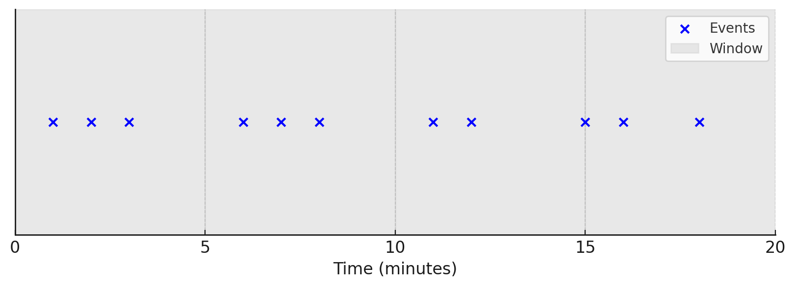
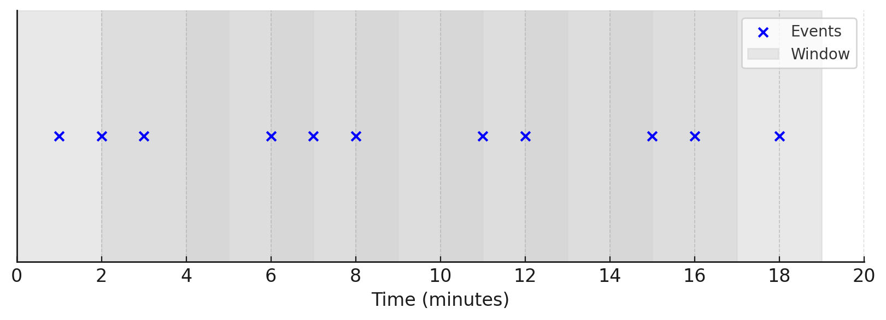
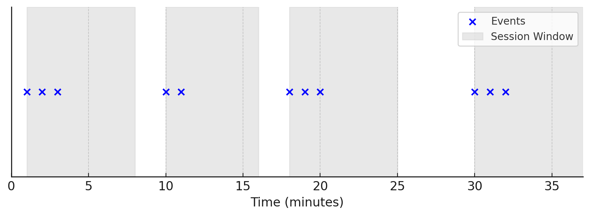

# Chapter 2 - Window Functions

Contents:

* Understanding time-based and count-based windows.
* Practical exercises with tumbling, sliding, and session windows.

## Stateful operations

Now let's see how we can aggregate things in Flink.
Let's say we want to calculate the mean of the credit amount per gender.
First, let's create a helper data structure:

```python
@dataclass
class Statistics:
    key: str
    total: int
    count: int

    def mean(self) -> Tuple[str, float]:
        return self.key, self.total / self.count

    def __add__(self, other: 'Statistics') -> 'Statistics':
        return Statistics(self.key, self.total + other.total, self.count + other.count)
```

This structure contains a `key` (which is gender in our case), a `total` sum of all seen values, and
a `count` number of seen values. These structures can be added, and we can compute the mean.

Now lets put the full reducing step here and explain it step by step:

```python
stream = stream
.map(lambda event: Statistics(event.sex, event.credit_amount, 1))
.key_by(lambda stats: stats.key)
.reduce(lambda left, right: left + right)
.map(Statistics.mean)
```

First, we need to convert events to the helper data structure inside the first `.map`.
We need that because we need to have a common structure for reducing the elements.

Then we use `.key_by` to select how we want to partition the data for reduction.
This is important as the reduction will occur independently for each key.

Now we compute reduction with `.reduce` on the two values. But, how we can have two values?
One of the values is a state - value that was previously returned by the `.reduce`.
In this case, we have a stateful operation, however, the state is "hidden" from us, we didn't
create it ourselves. We use `.reduce` to add values to accumulate totals and counts.

Finally, we use `.map` to calculate the final statistics. On each output, we will emit the updated
value of the mean.

## Windowed functions

Windows in Flink divide a stream into finite-sized “buckets” for computations. This section covers Flink’s windowing
mechanics and how to maximize its benefits.

A window is created when the first relevant element arrives and removed after its end timestamp plus allowed lateness.
Flink guarantees removal only for time-based windows. For example, a tumbling 5-minute event-time window with 1-minute
lateness opens at 14:00 and closes after the watermark passes 14:06.

Each window has a `Trigger` (defining when it fires) and a function (e.g., `ProcessWindowFunction`, `ReduceFunction`, or
`AggregateFunction`) to process its contents. Triggers can be time- or count-based and may purge data while keeping
metadata. An `Evictor` can remove elements before or after processing.

### Tumbling windows

Tumbling windows are a type of time-based window in Flink that divide a stream into fixed, non-overlapping intervals.
Each element belongs to exactly one window, ensuring no overlap:


For example, with a **5-minute tumbling window**, Flink groups events occurring between **12:00–12:05**,
**12:05–12:10**, and so on. When the window closes, Flink processes the accumulated data, and a new window starts
immediately.

Tumbling windows are useful for time-based aggregations, such as computing metrics per minute, hour, or day, and are
well-suited for scenarios where strict time segmentation is required.

To implement a 1-second tumbling window in Flink, we need to apply a `.window`

```python
windowed_stream = keyed_stream.window(TumblingProcessingTimeWindows.of(Time.seconds(1)))
```

Instead of relying on processing time, we can also limit the size of our window to a certain number of events instead.
For instance, to close our window after 100 were collected we need to define another trigger as follows:

```python
windowed_stream = windowed_stream.trigger(CountTrigger.of(100))
```

### Sliding windows

Sliding Windows in Flink are time-based windows that overlap, allowing events to belong to multiple windows. Each window
has a fixed size and moves forward by a defined slide interval.

For example, with a 5-minute window sliding every 2 minutes, windows cover 12:00–12:05, 12:02–12:07, 12:04–12:09, and so
on, as depicted below:


The blue dots indicate events occurring at specific timestamps, showing how events can belong to multiple windows due to
the overlap. This ensures continuous analysis over time, making sliding windows useful for trend detection, moving
averages, and real-time monitoring.

To implement such a window in Flink, we can use the `SlidingProcessingTimeWindows` class:

```python
windowed_stream = keyed_stream.window(SlidingProcessingTimeWindows.of(Time.minutes(5), Time.minutes(2)))
```

### Session windows

Session Windows in Flink group events based on periods of activity, separated by gaps of inactivity. Unlike tumbling or
sliding windows, session windows have variable lengths, closing only when no new events arrive within a defined timeout.

For example, with a 5-minute session gap, events arriving within 5 minutes of each other belong to the same window. If
no event appears within that period, the window closes, as depicted below:


Session windows are ideal for analyzing user behavior, tracking activity bursts, or identifying session-based patterns.

```python
windowed_stream = keyed_stream.window(EventTimeSessionWindows.with_gap(Time.minutes(5)))
```

### Processing Time vs. Event Time

Processing Time and Event Time are two ways Flink handles time when processing streams. Processing time depends on when
events are processed, while event time depends on when they actually happened, making event time more reliable for
historical analysis in out-of-order or delayed data streams.

1. **Processing Time**
    - Uses the system clock of the machine executing the Flink job.
    - Events are processed as they arrive, regardless of when they actually occurred.
    - Simple and efficient but can be inaccurate in cases of network delays or out-of-order events.
    - Best for low-latency applications where real-time arrival matters (e.g., monitoring dashboards).

2. **Event Time**
    - Uses timestamps from the event itself, reflecting when it was originally generated.
    - Requires **watermarks** to track event progress and handle late arrivals.
    - More accurate for time-based analytics but requires handling out-of-order events.
    - Best for applications needing correct time-based computations, such as log analysis, fraud detection, and
      historical trend tracking.  
