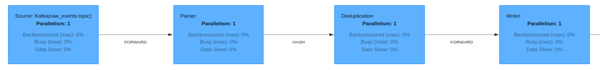

# Chapter 5 - Real-Life Use Case: Real-Time Data Deduplication

## Overcoming ClickHouse Limitations

Clickhouse storage fils are immutable and is not capable of deduplicating a row before inserting it. Deduplication
process involves more effort and is not immediate but **eventual**:

* At any moment in time your table can still have duplicates (rows with the same sorting key)
* The actual removal of duplicate rows occurs during the merging of parts
* Your queries need to allow for the possibility of duplicates

## Event steam deduplication using Apache Flink

With Apache Flink you can efficiently deduplicate streams in real-time, ensuring clean and reliable data for analytics.
Key benefits:

* Prevents inaccurate metrics caused by duplicate or inconsistent records.
* Reduces storage overhead by avoiding redundant entries, cutting storage costs and minimizing cleanup needs.
* Provides clean, reliable, and unique data for downstream systems without additional filtering.

By combining stateful processing, and strong consistency guarantees, Flink not only optimizes data streams but also
ensures that the data ingested into data warehouses such as ClickHouse is clean, accurate, and timely. This makes Flink
an ideal choice for powering real-time analytics pipelines where data quality and consistency are paramount.

### Overview

Stream deduplication in Apache Flink can be achieved by implementing a custom ProcessFunction. Here's the approach
overview:

1. Determine the attribute(s) in the records that uniquely identify a piece of data. For example, this could be a user
   ID, transaction ID, or a composite key of multiple fields.
2. Partition the stream by the deduplication key using the .keyBy() operation. This ensures that all records with the
   same key are processed by the same instance of the ProcessFunction.
3. Utilize Flink’s managed state to keep track of the keys that have already been processed.
4. If processing is event-time based, you need to handle late-arriving events. Configure a watermark strategy and use
   the ProcessFunction to check for and suppress duplicates even if they arrive late.
5. Implement the ProcessFunction to check each incoming record against the state. In short, if the key is present in the
   state, the record is a duplicate and should be filtered out.
6. Over time, the state can grow large, so implement state cleanup logic to remove outdated keys.



### Example

Main application:

```java
var env = FlinkEnvironment.createRemote();
var source = KafkaConnector.createSource(env, "raw_events");
var sink = KafkaConnector.createSink("deduped_events");
var stream = source
    	.map(Event::fromJSON)
    	.keyBy(e -> e.name)
    	.process(new DeduplicationProcessor(Duration.ofHours(1)))
    	.map(Event::toJSON);
stream.sinkTo(sink);
env.execute("Deduplication");
```

Deduplication processor:

```java
@Override public void open(OpenContext openContext) {
	state = getRuntimeContext().getState(new ValueStateDescriptor<>("creationTime", Long.class));
}
@Override public void processElement(Event e, KeyedProcessFunction<String, Event, Event>.Context ctx,  Collector<Event> out) {
	var currentTimeout = state.value();
	if (currentTimeout == null) out.collect(e); else ctx.timerService().deleteProcessingTimeTimer(currentTimeout);
	long timeout = System.currentTimeMillis() + ttl.toMillis();
	state.update(timeout);
	ctx.timerService().registerProcessingTimeTimer(timeout);
}
@Override public void onTimer(long timestamp, KeyedProcessFunction<String, Event, Event>.OnTimerContext ctx, Collector<Event> out) {
	state.clear();
}
```

### Best Practices for Deduplication in Apache Flink

* Use `.keyBy()` to isolate processing by deduplication keys.
* Use managed state with retention policies to limit growth.
* Handle late data and ensure correct ordering.
* Remove expired keys to conserve memory.
* Configure checkpointing to avoid duplicates on failure.
* Choose the right state backend, tune parallelism, and monitor metrics.
